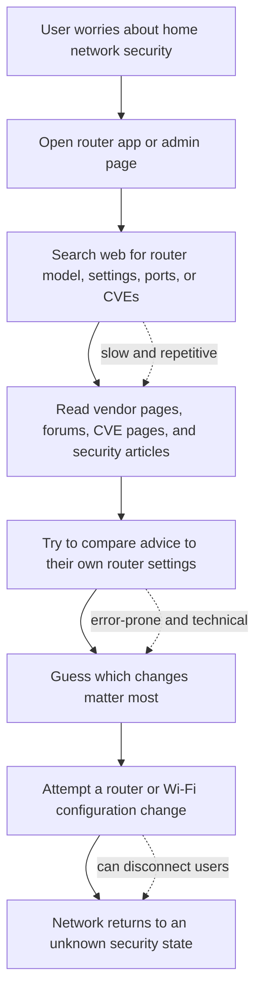
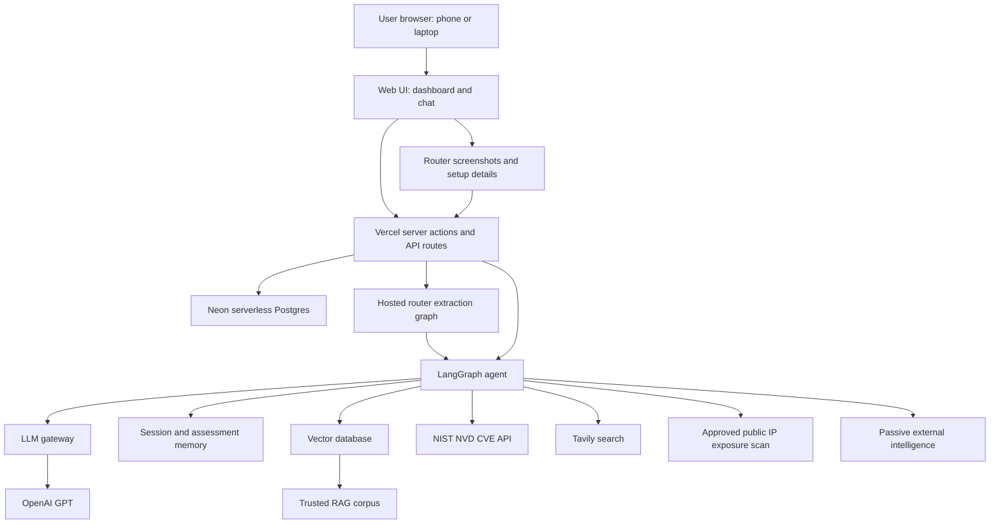
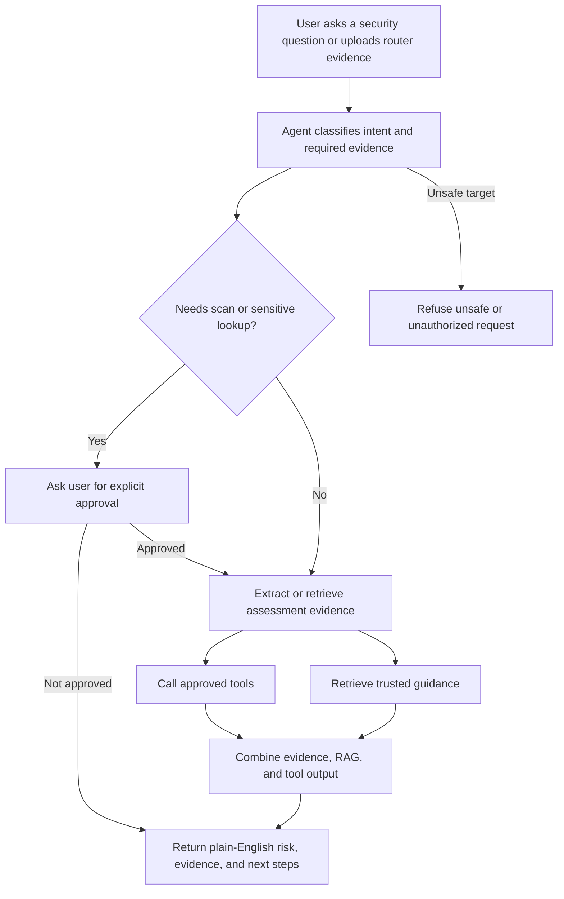

# GridWatch

GridWatch is an external-first AI home network security assistant for
non-technical home users. The MVP helps a user understand router risk and public
internet exposure without installing local scanning software.

This README is the written entry point for Certification Challenge Tasks 1-3. It
links to focused documents under `docs/` for deeper detail.

## Task 1: Defining Problem, Audience, and Scope

### 1-Sentence Problem Statement

Home network owners have no accessible, automated way to understand whether their
router, public internet exposure, or home-network configuration exposes them to
known security risks, or what practical action they should take next.

### Audience

The target user is a non-technical home network owner who uses a home router and
multiple connected devices such as smart TVs, cameras, thermostats, phones,
laptops, game consoles, and other IoT devices. They can set up Wi-Fi and install
apps, but they do not routinely inspect router settings, read vulnerability
advisories, or run network security tools.

### Why This Is a Problem

The user is trying to keep their home network safe enough for everyday use:
working from home, online banking, streaming, smart-home devices, family devices,
and ISP-provided router equipment. Today, they usually rely on default router
settings, ISP guidance, forum searches, or occasional security news that may not
apply to their exact router model or configuration.

That is not good enough because the evidence is fragmented and technical. The
user may not know their router model, firmware version, exposed services, or
whether a warning applies to them. Even when they find relevant information, it is
hard to prioritize what to do first without risking a configuration mistake that
breaks their internet connection.

### Current Workflow

### Evaluation Questions

| # | User Question | Expected System Behavior |
| --- | --- | --- |
| 1 | Can you review my router screenshots? | Extract router model, firmware, and configuration clues from uploaded evidence. |
| 2 | Is my home network exposed to the internet? | Ask approval, verify the user's router public IP, scan only that IP, and explain exposed services. |
| 3 | What do these open ports mean? | Use scan results and RAG guidance to explain service risk in plain English. |
| 4 | Is my router firmware vulnerable? | Query NVD and trusted sources using extracted router model and firmware details. |
| 5 | Has my public IP appeared in security intelligence? | Use approved passive external intelligence sources and explain confidence and limitations. |
| 6 | Have my home-network accounts been exposed? | With explicit user-provided account context, use breach intelligence where appropriate. |
| 7 | What security changes should I make first? | Combine screenshot evidence, scan results, passive intelligence, CVEs, and RAG guidance into prioritized remediation. |
| 8 | What devices are currently on my network? | Explain that local device inventory is a post-MVP feature. |

More detail: [Certification Challenge Plan](docs/certification_challenge_plan.md)

## Task 2: Proposed Solution

### 1-Sentence Solution Statement

GridWatch is a browser-based AI assistant that combines router evidence upload,
approved public-IP exposure scanning, passive external intelligence, CVE lookup,
trusted RAG guidance, and plain-English remediation for home users.

### MVP Feature Order

1. Router setup from uploaded screenshots and user-provided router details.
2. Approved public IP scan for exposed ports and services.
3. Passive external intelligence enrichment.
4. AI synthesis with router firmware/model CVE lookup and plain-English guidance.

### Infrastructure Diagram

### Component Choices

| Component | Choice | Why |
| --- | --- | --- |
| LLM | OpenAI (gpt-5.1) | Strong reasoning and plain-English security explanation; vision support for router screenshot extraction. |
| LLM gateway | Vercel AI Gateway | OpenAI-compatible gateway for cost tracking, fallback, and observability; low-friction since the app already deploys on Vercel (see `docs/model_choices.md`). |
| Agent orchestration | LangGraph | Makes tool routing, approval gates, and agent state explicit. |
| Tools | Screenshot extraction, exposure scan, passive intelligence, NVD, Tavily, RAG retriever | Matches the external-first MVP workflow. |
| Embedding model | To be finalized during implementation | Should be chosen based on retrieval quality, cost, and latency. |
| Vector database | Qdrant (Qdrant Cloud free tier) | Managed store for the deployed prototype; chosen for time efficiency given existing familiarity with the Qdrant API (see `docs/rag_scoping.md`). |
| Monitoring | LangSmith for the hosted graph; Langfuse remains optional later | Tracks traces, evaluations, latency, prompts, and tool behavior. |
| Evaluation framework | RAGAS plus custom LLM-as-judge checks | Covers retrieval quality, grounded answers, and safety behavior. |
| User interface | Browser dashboard and chat | Meets the phone/laptop browser requirement. |
| Deployment | Vercel frontend/API plus hosted LangGraph deployment | Avoids local installation for MVP while keeping AI/security tokens server-side. |
| Memory | HTTP-only sessions plus Neon serverless Postgres assessment memory | Stores users, sessions, extracted router facts, scan approval, and retained uploads. |

### Agent Workflow

The agent starts with the user's uploaded evidence, setup details, or question. It
classifies the request, determines whether it needs RAG, NVD, Tavily, passive
intelligence, or an active exposure scan, and checks whether explicit approval is
required.

If the request is safe and approved, the agent calls the relevant tools, retrieves
trusted guidance, and synthesizes a response that separates confirmed evidence,
likely interpretation, uncertainty, and recommended next steps. If the user asks
for arbitrary public internet scanning, unrelated domain scanning, or another
unsafe action, the agent refuses and explains the boundary in plain English.

More detail: [Architecture](docs/architecture.md) and
[Model Choices](docs/model_choices.md)

## Task 3: Dealing with the Data

### Default Chunking Strategy

The RAG corpus uses recursive character splitting with markdown-aware boundaries
(`RecursiveCharacterTextSplitter`, `chunk_size=900`, `chunk_overlap=120`, splitting
on headings and paragraphs first). See `agent/rag.py`.

This is a practical default for security guidance because the source material is
organized by short sections, checklists, definitions, and remediation steps.
Breaking on `##`/`###` headings keeps each chunk topically coherent, and the size
is large enough to preserve a full recommendation while small enough to retrieve
targeted passages for specific router settings, ports, protocols, CVEs, or
remediation questions.

### Data Sources

| Data Source | Role |
| --- | --- |
| Trusted security guidance | Provides stable RAG context for router hardening, Wi-Fi security, exposed-service risk, and plain-English remediation. |
| Router screenshots and setup details | Provide user-specific router model, firmware, and configuration clues. |
| Approved public IP exposure scan results | Provide current active evidence of exposed ports and services on the user's verified router public IP. |
| Passive external intelligence | Adds source-stamped context from public internet intelligence sources when approved. |
| NVD CVE records | Provide authoritative vulnerability facts for router firmware/model lookup. |
| Tavily search results | Provide fresh vendor guidance or public source discovery when the curated corpus and NVD are insufficient. |

### External APIs

| API | Role |
| --- | --- |
| NIST NVD | Authoritative CVE lookup for router model, firmware, CPE, or CVE ID. |
| Tavily | Public web search for current vendor guidance and source discovery. |
| InternetDB or Shodan | Recommended MVP passive public-IP service observations. |
| AbuseIPDB | Optional public-IP reputation context for the verified router public IP. |
| HaveIBeenPwned | Optional breach exposure checks for explicit user-provided account context. |

### How Data and APIs Interact During Usage

The user starts by uploading router screenshots or entering router details. The
system extracts structured facts such as router model, firmware version, and
configuration clues, then stores those facts in assessment memory.

When the user asks about exposure, the system verifies the router public IP and
requires explicit approval before running a limited external exposure scan. The
scan result can be enriched with one passive intelligence source, but passive
results are treated as supporting context rather than proof of current exposure.

When the user asks about vulnerabilities or remediation, the agent uses extracted
router facts to query NVD and, when needed, Tavily for current vendor guidance. It
retrieves trusted RAG context to explain technical findings in plain English and
returns a prioritized remediation plan.

More detail: [Data Strategy](docs/data_strategy.md),
[RAG Scoping](docs/rag_scoping.md), and
[External Intelligence Sources](docs/external_intelligence_sources.md)

## Current MVP Boundary

The MVP does not require a local scanner, Docker container, Raspberry Pi
appliance, Tailscale, Twingate, or router integration. Local LAN scanning and
local device inventory are deferred until after the external-first MVP.

Safety boundary: GridWatch must refuse arbitrary public IP, domain, or CIDR
scanning. The only permitted active scan target is the user's own verified router
public IP after explicit approval.

More detail: [Security and Privacy](docs/security_privacy.md), [Deployment](docs/deployment.md), and [Local Development](docs/local_development.md)
