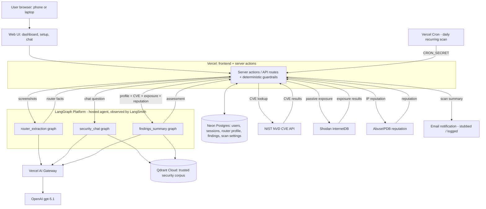

# GridWatch

GridWatch is an external-first AI home network security assistant for non-technical
home users. It helps someone understand their router risk and public internet
exposure — and what to actually do about it — without installing any local scanning
software. The user uploads router screenshots or enters a few details from a browser;
GridWatch extracts the relevant facts, runs read-only external checks, and returns a
plain-English risk assessment with prioritized next steps.

## What it does

- **Router evidence extraction** — pulls model, firmware, and configuration clues from
  uploaded router screenshots (vision) and user-provided details.
- **Vulnerability lookup** — queries the NIST NVD CVE database for known issues
  affecting the extracted router vendor/model.
- **Passive exposure check** — reads Shodan's InternetDB catalog for a verified public
  IP (read-only; private/LAN addresses are rejected).
- **IP reputation check** — looks up the public IP's abuse/reputation score from
  AbuseIPDB (read-only, public-IP only) and factors it into the risk assessment.
- **Recurring scans + email alerts** — an opt-in daily re-scan (Vercel Cron) that
  emails a plain-English summary, with a "run now" button to preview the email
  (delivery is currently stubbed/logged; see the roadmap).
- **Grounded guidance (RAG)** — retrieves hardening and remediation guidance from a
  curated corpus of official security sources (NIST, NSA, CISA, OWASP, FTC, FBI IC3,
  Wi-Fi Alliance, FIRST/CVSS), each chunk carrying source provenance.
- **Plain-English assessment** — synthesizes the findings into a prioritized,
  jargon-free remediation plan (with a deterministic heuristic fallback).
- **Conversational chat** — answers follow-up questions grounded in the same corpus.
- **Deterministic guardrails** — screens chat input (injection / off-topic / trivial)
  and skips the paid LLM call on a clean scan.

## Architecture

The Vercel server-action layer is the orchestrator: it enforces guardrails, calls the
read-only security tools directly, and invokes the hosted LangGraph agent graphs. The
three graphs run on LangGraph Platform (traced by LangSmith) and reach OpenAI through
the Vercel AI Gateway.



Full detail — agent workflow, tool boundaries, memory design, and deployment — is in
[docs/architecture.md](docs/architecture.md).

## Tech stack

| Layer | Choice |
| --- | --- |
| Web app / API | Next.js (App Router, server actions), deployed on Vercel |
| Agent orchestration | LangGraph (3 hosted graphs) on LangGraph Platform |
| LLM | OpenAI `gpt-5.1` via the Vercel AI Gateway |
| Embeddings | OpenAI `text-embedding-3-small` |
| Vector store | Qdrant Cloud |
| Database | Neon serverless Postgres |
| Observability | LangSmith (tracing + evals) |
| Evaluation | RAGAS metrics (LLM-as-judge) run via LangSmith / offline harness |

## Repository structure

```
.
├── app/          # Next.js App Router pages, server actions, API routes
├── lib/          # Server-side helpers (auth, db, tools, agent clients, guardrails)
├── agent/        # Python LangGraph agent (extraction, chat, summary, RAG) + corpus
├── eval/         # RAGAS evaluation harness and committed test set
├── docs/         # Detailed documentation
└── deliverables.md  # AIE Certification Challenge traceability
```

The Next.js app lives at the repo root for zero-config Vercel deploys; the Python
agent under `agent/` deploys separately to LangGraph Platform.

## Getting started

Web app (root, Next.js / TypeScript):

```bash
npm install          # install dependencies
npm run setup:local  # create .env.local from the example
npm run dev:local    # start the local dev server

npm run lint         # lint
npm run typecheck    # tsc --noEmit
npm run test         # vitest
npm run build        # production build
```

Agent (`agent/`, Python via uv):

```bash
cd agent
uv venv
uv pip install -e .
black . && ruff check .
```

See [docs/local_development.md](docs/local_development.md) for environment variables
and the full local setup, and [docs/deployment.md](docs/deployment.md) for deployment.

## Safety & scope

GridWatch is **external-first and read-only today**. It requires no local scanner,
Docker container, appliance, or router integration. The IP-based checks (Shodan
InternetDB exposure, AbuseIPDB reputation) are passive catalog/database lookups —
private/LAN addresses are always rejected, and nothing performs an active scan.

An approved **active** exposure scan (restricted to the user's own verified router IP,
behind explicit approval and target validation) and additional intelligence sources
are planned — see [docs/roadmap.md](docs/roadmap.md). Local LAN scanning and device
inventory remain post-MVP.

## Documentation

- [docs/architecture.md](docs/architecture.md) — infrastructure, agent workflow, tool boundaries, memory
- [docs/model_choices.md](docs/model_choices.md) — LLM and gateway reasoning
- [docs/data_strategy.md](docs/data_strategy.md) · [docs/rag_scoping.md](docs/rag_scoping.md) — data and RAG design
- [docs/external_intelligence_sources.md](docs/external_intelligence_sources.md) — passive-intel sources and privacy boundaries
- [docs/evaluation_plan.md](docs/evaluation_plan.md) — eval harness, metrics, before/after results
- [docs/security_privacy.md](docs/security_privacy.md) — scan restrictions and data handling
- [docs/deployment.md](docs/deployment.md) · [docs/local_development.md](docs/local_development.md) — deploy and local dev
- [docs/roadmap.md](docs/roadmap.md) — planned work beyond the POC
- [deliverables.md](deliverables.md) — AIE Certification Challenge deliverables and traceability
