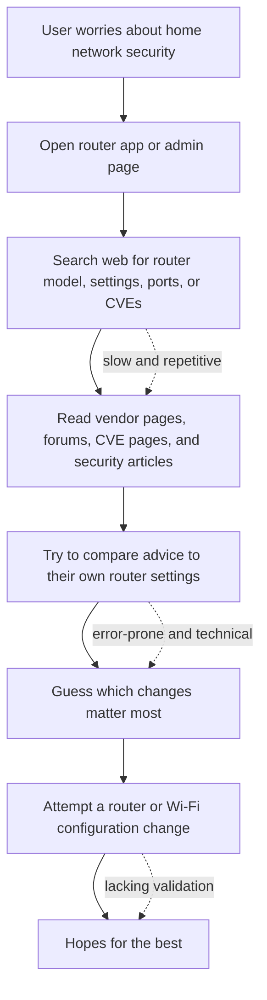
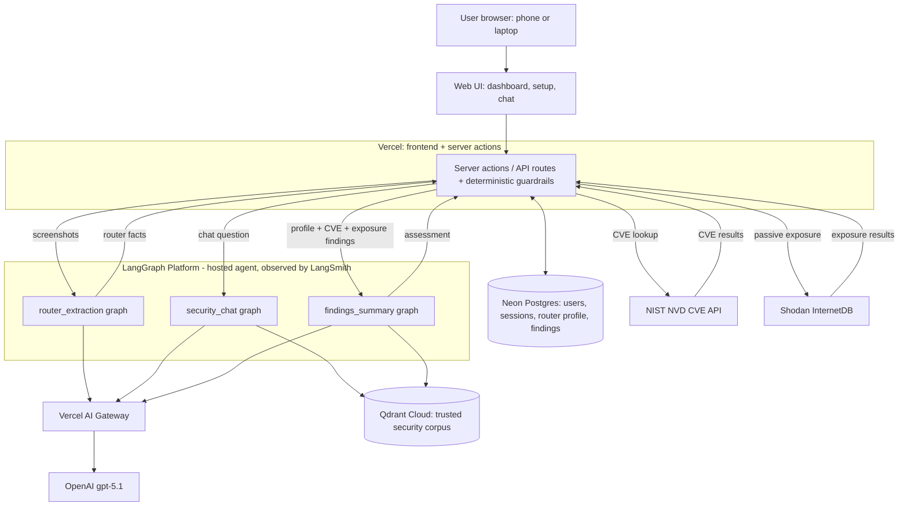
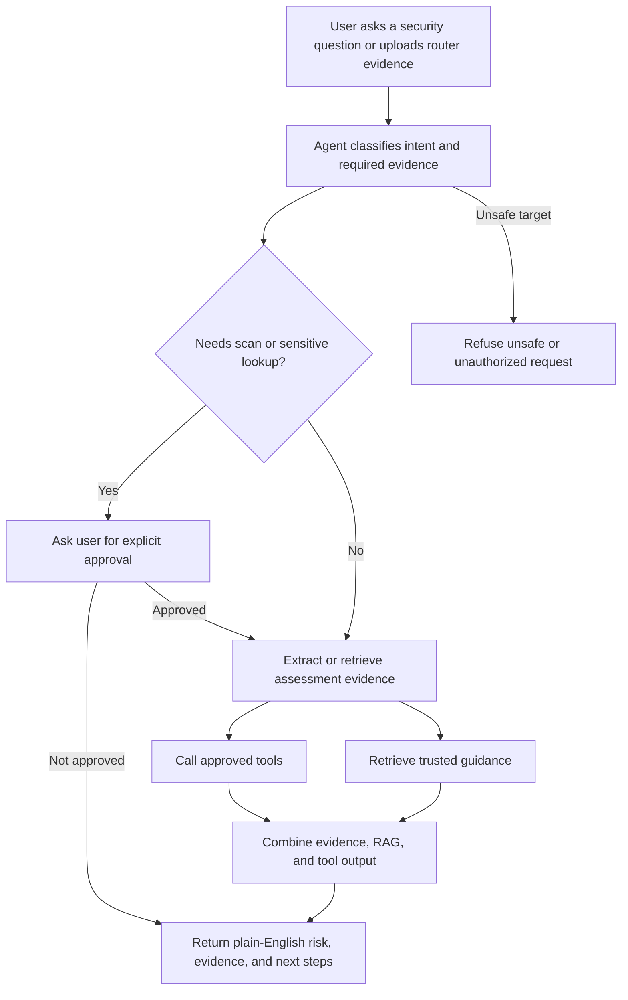

# AIE Certification Challenge Deliverables for GridWatch

## Task 1 — Defining Problem, Audience, and Scope

### Problem Statement

As more devices join the home network, security grows more complex — yet the average home user lacks the knowledge to tell whether their router, internet exposure, or configuration puts them at risk, or what to do about it.

### Audience

The average home users setups up their router and only thinks about it when the WiFi is down. If they are lucky it came with secure defaults and it automatically updates. Today's software world is moving at faster paces that has full security teams struggling to detect vulnerabilities at work with teams to get them patched in a timely manner. How well are third party home networking vendors going to keep up with AI attackers scanning for new zero days?

At the same time, the smart home or IoT devices market are becoming more and more common with no solid tracking on how those devices are exposing your home to risk. What would happen if a router was compromised on a home device with a smart lock on the front door? It is time to expand common industry security tooling to the home user so they have visibility and guidance to keeping their home secure.

### Current Workflow

I would call this a very optimistic workflow assuming that the home user knows all the sources to pull the data. Most likely they just setup router and move on with life.

### Evaluation Questions

| # | User Question | Expected System Behavior |
| --- | --- | --- |
| 1 | Can you review my router screenshots? | Extract router model, firmware, and configuration clues from uploaded evidence. |
| 2 | Is my home network exposed to the internet? | Ask approval, verify the user's router public IP, scan only that IP, and explain exposed services. |
| 3 | What do these open ports mean? | Use scan results and RAG guidance to explain service risk in plain English. |
| 4 | Is my router firmware vulnerable? | Query NVD and trusted sources using extracted router model and firmware details. |
| 5 | Has my public IP appeared in security intelligence? | Use approved passive external intelligence sources and explain confidence and limitations. |

---

## Task 2 — Propose a Solution

GridWatch is a browser-based AI assistant that combines router evidence upload, approved public-IP exposure scanning, passive external intelligence, CVE lookup, trusted RAG guidance, and plain-English remediation for home users.

### Infrastructure Diagram

### Component Choices

| Component | Choice | Why |
| --- | --- | --- |
| LLM | OpenAI (gpt-5.1) | I am limited to OpenAI models as that is what my work has given me to work with right now. I specifically went with a slightly older model to simulate the behavior of security information being out of date quickly.  |
| LLM gateway | Vercel AI Gateway | We used this during the course and it was easy to built in the future versatility for switching out models. |
| Agent orchestration | LangGraph | This simplified hosting and monitoring the agent. I would like to test deploying this stack in AWS which is my daily environment but I was afraid of getting caught up in AWS minutiae in a small time frame. |
| Embedding model | OpenAI text-embedding-3-small | Chosen based off my limited exposures and choosing to use OpenAI. |
| Vector database | Qdrant (Qdrant Cloud free tier) | This seems like a nature expansion of moving from the in memory Qdrant to support an ephemeral agent that would need to persist knowledge across sessions. |
| Monitoring | LangSmith for the hosted graph | Lives right along side my agent deployment so I can minimize jumping between tools |
| Evaluation framework | RAGAS plus custom LLM-as-judge checks | Covers retrieval quality, grounded answers, and safety behavior. |
| User interface | Browser dashboard and chat | I am not a UI developer so this seems like the easiest to get something working |
| Deployment | Vercel frontend/API plus hosted LangSmith deployment | Allowed for easy local testing and simple deployment without setting up full CI/CD workflows |
| Memory | HTTP-only sessions plus Neon serverless Postgres assessment memory | Stores users, sessions, extracted router facts, scan approval, and retained uploads. |

### Agent Workflow

---

## Task 3 — Dealing with the Data 

For the default chunking strategy I chose `RecursiveCharacterTextSplitter` with `chunk_size=900` and `chunk_overlap=120`. I tried to go generic without making things too big. My RAG data is mostly technical documentation that comes from multiple government and industry sources, so I wanted to allow the chunks to be flexible enough to capture context while still being relevant.

The files that make up my main RAG datasources are stored at [agent/corpus/](agent/corpus) including a CSV file that I used to capture relevant metadata I used as a part of the loading process. These files are sources I pulled from that I feel represent a cross reference for the technical home user that they were unlikely to know about or evaluate. I manually triggered their upload with [agent/ingest.py](agent/ingest.py) which is documented in [docs/deployment.md/Updating the RAG corpus](docs/deployment.md#updating-the-rag-corpus).

---

## Task 4 — Build End-to-End Agentic RAG Prototype 

Deployment URL: https://gridwatch-eosin.vercel.app/

Setting up a user provides a token so I don't have random users trying to sign up for the service. This will be added to the homework form under `Is there anything else you'd like to share with us?`

---

## Task 5 — Evals (2 pts)

Synthetic Dataset: [eval/testset.json](eval/testset.json) 

Evaluation: [eval/run_eval.py](eval/run_eval.py)

Two modes: 
- Default mode runs a LangSmith experiment on the dataset that was uploaded to LangSmith, 
- --local mode scores the local testset.json instead and writes a table to artifacts/. Both modes use the same Ragas metrics: Faithfulness, Context Recall, Answer Accuracy.

Based off my initial results I did a bit of curating and removed some lower scored values that were caused by questions that were way off. When reviewing the dataset I can tell that the more technical questions were hitting the RAG data better while broader home user questions are less grounded. I would like to build on this in future versions either by adding less technical corpus or by testing different embeddings and chunk settings.

---

## Task 6 — Improving the Prototype / Advanced Retrieval

### Advanced retrieval technique + why it fits this use case

The original RAG implementation mirrored our class beginnings of dense sementic search. To improve the results I implemented hybrid retrieval which combines dense (semantic) search with BM25 lexical search. I felt like this was a good fit because the many technical queries need a lexical search, for instance when the tool is looking CVE references. So I beleived including a BM25 search as part of the hyrbid would improve the results.

### How it compares to the original (dense) RAG

Measured with `run_eval.py --compare` over the official corpus (15 curated questions):

| Metric | Dense (baseline) | Hybrid (advanced) | Delta |
| --- | --- | --- | --- |
| Faithfulness | 0.814 | 0.835 | +0.021 |
| Context Recall | 0.630 | 0.603 | -0.026 |
| Answer Accuracy | 0.650 | 0.667 | +0.017 |

---

## Task 7 — Next Steps for Demo Day (2 pts)

As part of the final demo day product, I want to focus on getting the chat guidance more grounded in the RAG data. I want to add a "Show Sources" button that will display the sources that were used to generate the answer. This will help to demonstrate the grounding of the answers and provide transparency to the user.

I also want to add a couple more public tools to the findings to round out out the security view. While more features could be a distraction, I want to make sure to provide more context so the LLM can give the user better guidance.

I also want to test out performance changes made by using more updated models, different embeddings and chunking strategies.

[docs/roadmap.md](docs/roadmap.md)

