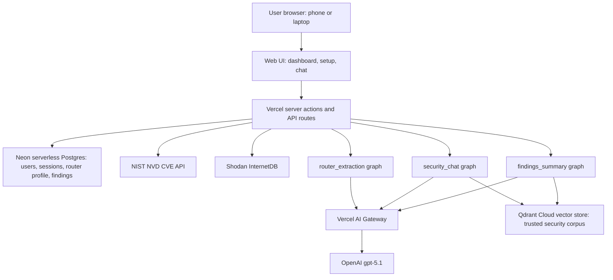
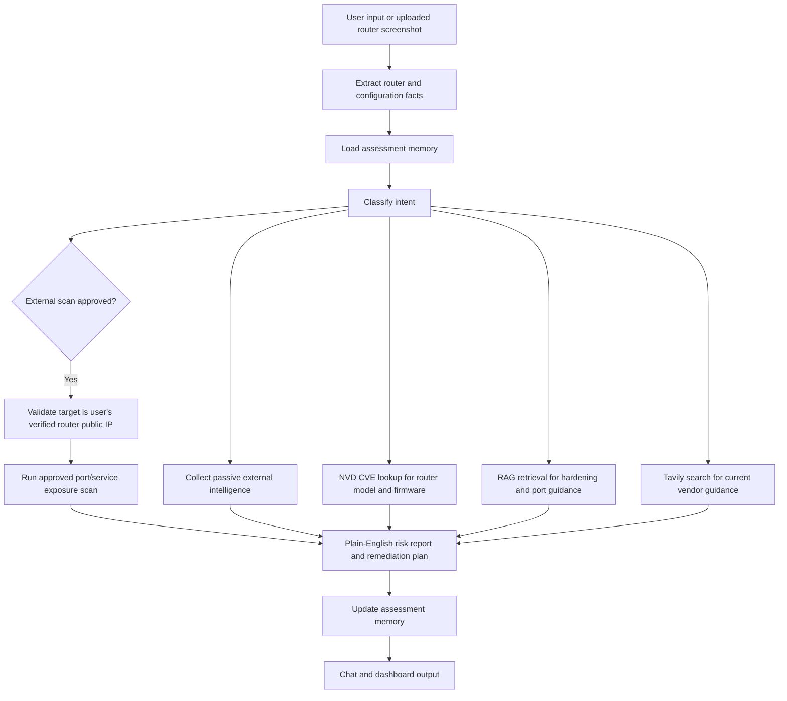

# Architecture

## Challenge Alignment

This document supports Task 2 and Task 4 of the Certification Challenge by
explaining the proposed infrastructure, agent workflow, tool boundaries, memory,
human approval steps, and deployment model.

## Goals

- Provide a browser-based assistant that works on a laptop and phone.
- Avoid local software installation for the MVP.
- Use router screenshots, user-provided details, and approved external checks to
  assess home network exposure.
- Use trusted open-source tools and authoritative public data where possible.
- Make tool use inspectable and extensible.
- Protect users from unsafe or unauthorized scanning behavior.

## MVP Feature Order

1. Router setup from uploaded screenshots and user-provided router details.
2. Approved public IP scan for exposed ports and services.
3. Passive external intelligence enrichment.
4. AI synthesis with router firmware/model CVE lookup and plain-English guidance.

## High-Level Infrastructure

## MVP Scope

The MVP is an external-first cloud service. It does not require a local scanner,
Docker container, Raspberry Pi appliance, Tailscale, Twingate, or router
integration.

The user provides evidence through the browser, and the cloud service performs
only approved external checks against the user's verified router public IP.

## Selected External-First Design

1. The browser authenticates to Vercel server-side routes using HTTP-only session cookies.
2. The first deployment allows only one configured user; public signup is disabled after that user exists.
3. The user uploads router screenshots or enters router details.
4. The hosted LangGraph extraction graph extracts structured facts such as router vendor, model, firmware, remote administration status, UPnP clues, port forwarding clues, and public IP context when available.
5. Neon serverless Postgres stores users, sessions, retained router evidence, extracted fields, missing fields, and scan approval state.
6. The user runs read-only security checks from the dashboard.
7. The Vercel API layer calls NIST NVD (CVE lookup by router vendor/model) and Shodan InternetDB (passive exposure for the verified public IP) directly; private/LAN addresses are rejected. An approved *active* port/service scan is planned — see `docs/roadmap.md`.
8. Deterministic guardrails run in the API layer before any model call: they block injection/off-topic/trivial chat input, and skip the LLM summary on a clean scan to save cost.
9. The `findings_summary` graph, grounded in the trusted RAG corpus in Qdrant, synthesizes a plain-English risk report and prioritized remediation (a deterministic heuristic is the fallback).
10. The `security_chat` graph answers follow-up questions, calling the RAG retriever tool for grounded guidance.

## Deferred Local Connectivity

Local LAN scanning remains a post-MVP roadmap item. Future options include a
packaged desktop scanner, Raspberry Pi appliance, router integration, or managed
overlay connectivity. These are intentionally outside the MVP to keep the project
focused on the AI service, RAG, tool orchestration, and evaluation requirements.

## Agent Workflow

> This is the conceptual assessment flow. In the build today, the read-only checks
> (NVD, Shodan InternetDB) are orchestrated by the Vercel API layer rather than the
> model, and the `Scan` (active port scan) and `Search` (Tavily) steps are planned,
> not built — see `docs/roadmap.md`.

## Human Approval Gates

The agent must ask for explicit user approval before:

1. Running an external exposure scan.
2. Uploading or processing router screenshots that may contain sensitive network
   details.
3. Querying third-party intelligence services with the user's public IP, email,
   domain, router model, or firmware when not strictly necessary for the
   user-requested task.
4. Suggesting disruptive remediation steps such as factory reset, firmware flash,
   or router configuration changes that could break connectivity.

## Scan Safety Restrictions

The agent is prohibited from open internet scans except for the user's own
verified router external IP address when the user explicitly approves the scan.

Implementation requirements:

1. The cloud API must reject arbitrary public IP, domain, or CIDR scan targets.
2. The only eligible active-scan target is the verified public IP associated with
   the user's assessment session.
3. The system must not scan third-party public IPs or domains provided in
   free-form chat.
4. The agent must explain why it refused any unsafe scan request.
5. External scans should be limited to low-intensity exposure checks suitable for
   confirming open ports and common service banners on the user's router, not
   broad vulnerability probing.

## Tooling Boundaries

| Tool | Runs Where | Allowed Scope | Notes |
| --- | --- | --- | --- |
| Screenshot/evidence extractor | Cloud | User-uploaded router screenshots and form fields | Extracts router model, firmware, and configuration clues. |
| External exposure scan | Cloud | Verified router public IP only | Requires approval and strict target validation. |
| NVD CVE lookup | Cloud | Router model, firmware, CPE, or CVE ID | Authoritative vulnerability source. |
| Tavily search | Cloud | Public web search | Used for current vendor guidance and source discovery. |
| Passive external intelligence | Cloud | Verified public IP or user-approved account/domain context | Supports enrichment from sources such as Shodan, InternetDB, AbuseIPDB, and HaveIBeenPwned. |
| RAG retriever | Cloud | Trusted project corpus | Used for remediation, port explanations, and plain-English guidance. |

## Memory Design

The MVP should have two memory layers:

1. **Session memory:** Chat history, active task context, uploaded evidence
   summaries, and recent tool outputs.
2. **Assessment memory:** User-approved router details, firmware version,
   external exposure findings, passive intelligence findings, acknowledged CVEs,
   and previous remediation status.

Sensitive values should be minimized. Where possible, store normalized evidence
summaries instead of raw screenshots, complete public-IP history, or full tool
payloads.

## Deployment Model

The deployed prototype exposes a Vercel-hosted browser endpoint and server-side API routes. The frontend/API stores user and router profile state in Neon serverless Postgres and calls a hosted LangGraph deployment for router screenshot extraction. LangSmith/LangGraph Platform hosts and observes the graph; browser clients never call Anthropic, LangGraph, LangSmith, Shodan, Tavily, or other security APIs directly.

It should not require any local scanner for the MVP. For the certification demo, synthetic screenshots, sanitized router details, and safe external-scan fixtures can be used when real home-network evidence should not be shown.
