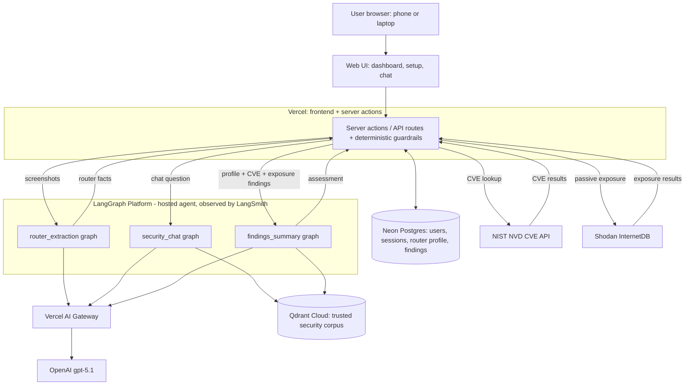
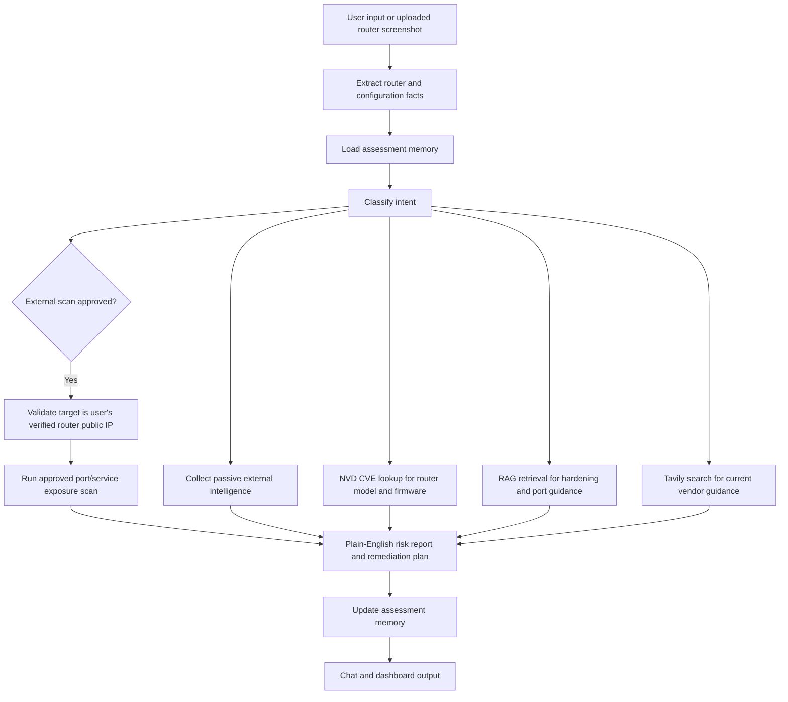

# Architecture

## Challenge Alignment

This document supports Task 2 and Task 4 of the Certification Challenge by
explaining the proposed infrastructure, agent workflow, tool boundaries, memory,
human approval steps, and deployment model.

## Goals

- Provide a browser-based assistant that works on a laptop and phone.
- Avoid local software installation for the MVP.
- Use router screenshots, user-provided details, and approved external checks to
  assess home network exposure.
- Use trusted open-source tools and authoritative public data where possible.
- Make tool use inspectable and extensible.
- Protect users from unsafe or unauthorized scanning behavior.

## MVP Feature Order

1. Router setup from uploaded screenshots and user-provided router details.
2. Approved public IP scan for exposed ports and services.
3. Passive external intelligence enrichment.
4. AI synthesis with router firmware/model CVE lookup and plain-English guidance.

## High-Level Infrastructure

The Vercel server-action layer is the orchestrator: it enforces guardrails, calls
NIST NVD and Shodan InternetDB directly, and invokes the hosted LangGraph graphs over
HTTP. The three graphs run on LangGraph Platform (traced by LangSmith) and reach
OpenAI through the Vercel AI Gateway. The CVE + passive-exposure results flow back to
the API, which feeds them (with the router profile) into `findings_summary` — when the
scan isn't clean — and persists the tool results and assessment to Neon. On a
clean/low-risk scan the LLM call is skipped in favor of a local heuristic.

## MVP Scope

The MVP is an external-first cloud service. It does not require a local scanner,
Docker container, Raspberry Pi appliance, Tailscale, Twingate, or router
integration.

The user provides evidence through the browser, and the cloud service performs
only approved external checks against the user's verified router public IP.

## Selected External-First Design

1. The browser authenticates to Vercel server-side routes using HTTP-only session cookies.
2. The first deployment allows only one configured user; public signup is disabled after that user exists.
3. The user uploads router screenshots or enters router details.
4. The hosted LangGraph extraction graph extracts structured facts such as router vendor, model, firmware, remote administration status, UPnP clues, port forwarding clues, and public IP context when available.
5. Neon serverless Postgres stores users, sessions, retained router evidence, extracted fields, missing fields, and scan approval state.
6. The user runs read-only security checks from the dashboard.
7. The Vercel API layer calls NIST NVD (CVE lookup by router vendor/model) and Shodan InternetDB (passive exposure for the verified public IP) directly; private/LAN addresses are rejected. An approved *active* port/service scan is planned — see `docs/roadmap.md`.
8. Deterministic guardrails run in the API layer before any model call: they block injection/off-topic/trivial chat input, and skip the LLM summary on a clean scan to save cost.
9. The `findings_summary` graph, grounded in the trusted RAG corpus in Qdrant, synthesizes a plain-English risk report and prioritized remediation (a deterministic heuristic is the fallback).
10. The `security_chat` graph answers follow-up questions, calling the RAG retriever tool for grounded guidance.

## Deferred Local Connectivity

Local LAN scanning remains a post-MVP roadmap item. Future options include a
packaged desktop scanner, Raspberry Pi appliance, router integration, or managed
overlay connectivity. These are intentionally outside the MVP to keep the project
focused on the AI service, RAG, tool orchestration, and evaluation requirements.

## Agent Workflow

> This is the conceptual assessment flow. In the build today, the read-only checks
> (NVD, Shodan InternetDB) are orchestrated by the Vercel API layer rather than the
> model, and the `Scan` (active port scan) and `Search` (Tavily) steps are planned,
> not built — see `docs/roadmap.md`.

## Human Approval Gates

Today the security checks are **read-only and user-initiated**: the user deliberately
uploads a screenshot and clicks "Run checks" to trigger the NVD + passive InternetDB
lookups. Nothing performs an active scan or a disruptive change, so no additional
in-app approval step is enforced yet.

Explicit approval gates — before an **active** exposure scan and before sensitive
third-party lookups (breach/reputation services) — are part of the planned
active-scan work in `docs/roadmap.md`.

## Scan Safety Restrictions

**Today (read-only only):** the only IP-based tool is the passive Shodan InternetDB
lookup. It rejects private/LAN and non-public addresses (`isValidPublicIp` in
`lib/ip.ts`) and reads Shodan's already-published catalog — it does not actively scan
the target. It runs against the public IP stored in the user's profile.

Known limits of the current build:

1. It does **not** yet verify that the public IP belongs to the user — any public IP
   in the profile is accepted (ownership verification is a planned guardrail).
2. There is **no active port/service scan**, and therefore none of the active-scan
   approval or target-verification controls exist yet.
3. Chat cannot trigger any scan — its only tool is the RAG retriever.

**Planned** (see `docs/roadmap.md`): an approved active exposure scan restricted to
the user's verified router IP, with explicit approval, target verification, rejection
of arbitrary public IP/domain/CIDR targets, refusal-with-explanation for unsafe
requests, and low-intensity checks only.

## Tooling Boundaries

| Tool | Status | Allowed Scope | Notes |
| --- | --- | --- | --- |
| Screenshot/evidence extractor | Built | User-uploaded screenshots + form fields | `router_extraction` graph; extracts model, firmware, config clues. |
| NIST NVD CVE lookup | Built | Router vendor/model keyword | Read-only; called by the API layer. |
| Shodan InternetDB passive exposure | Built | Public IP in the profile (private/LAN rejected) | Read-only passive catalog lookup; ownership not yet verified. |
| RAG retriever | Built | Trusted project corpus (Qdrant) | Remediation, port, and CVE explanation. |
| Active exposure scan | Planned | Verified router IP only | Approval + target validation — `docs/roadmap.md`. |
| Tavily search | Planned | Public web search | `docs/roadmap.md`. |
| AbuseIPDB / HaveIBeenPwned | Planned | Verified IP / consented account context | `docs/roadmap.md`. |

## Memory Design

Two memory layers exist today:

1. **Session / conversation memory:** per-user chat history in Neon
   (`chat_messages`), plus HTTP-only session cookies. The LangGraph agent also keeps
   per-user thread state (a deterministic thread + namespace per user) so runs never
   mix across users.
2. **Assessment memory:** the router profile (vendor, model, firmware, settings,
   public IP, scan-approval flags, uploaded evidence) in `router_profiles`, and the
   latest CVE + passive-exposure findings plus the generated assessment in
   `security_findings`.

Current data-handling reality and its gaps:

- Uploaded screenshots are stored **raw** (base64) in Postgres, not as normalized
  summaries.
- Findings store the full normalized tool results (CVE list + exposure).
- There is no acknowledged-CVE or remediation-status tracking yet.

Minimizing stored sensitive data — normalized summaries instead of raw screenshots,
moving images to private object storage, and acknowledged-finding / remediation-status
tracking — is planned in `docs/roadmap.md`.

## Deployment Model

The deployed prototype exposes a Vercel-hosted browser endpoint and server-side API routes. The frontend/API stores user and router profile state in Neon serverless Postgres and calls a hosted LangGraph deployment for router screenshot extraction. LangSmith/LangGraph Platform hosts and observes the graph; browser clients never call Anthropic, LangGraph, LangSmith, Shodan, Tavily, or other security APIs directly.

It should not require any local scanner for the MVP. For the certification demo, synthetic screenshots, sanitized router details, and safe external-scan fixtures can be used when real home-network evidence should not be shown.
